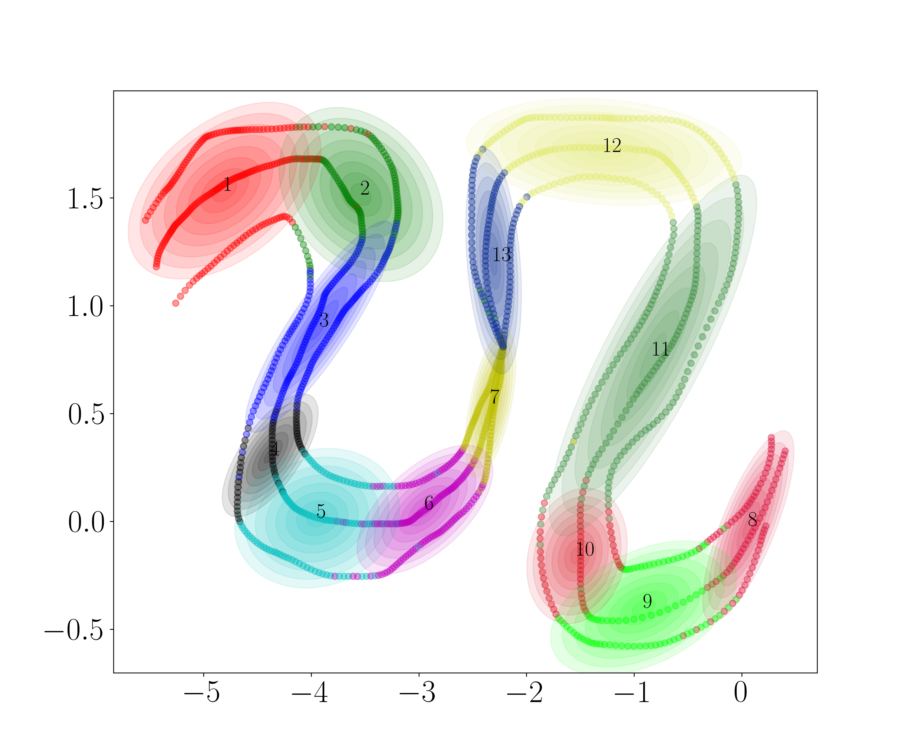
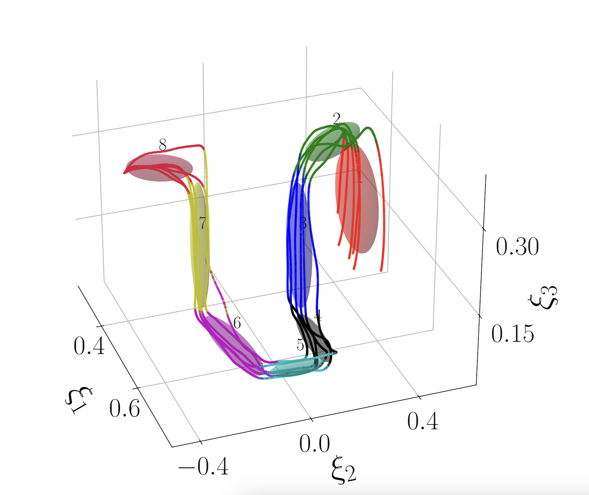

# Directionality-Aware Mixture Model Parallel Sampling for Efficient Dynamical System Learning

| [Paper](https://arxiv.org/abs/2309.02609) | [Video](https://www.youtube.com/watch?v=pLnZkyTlyNA&ab_channel=SunanSun) |


This is the implementation of Directionality-Aware Mixture Model(DAMM) designed for the learning of Linear Parameter Varying Dynamical System (LPV-DS). This module has been integrated as a part of the [LPV-DS](https://github.com/SunannnSun/lpvds) framework.
The following figures show 2D and 3D example clustering results produced by DAMM:

<p align="center">
  
  
</p>

## Datasets
The datasets include [LASA handwriting dataset](https://github.com/justagist/pyLasaDataset) and [PC-GMM dataset](https://github.com/nbfigueroa/phys-gmm). One can change and choose the dataset in `main.py` following the instructions in comments. To test your own dataset, please examine and follow the data structure of the inputs in the example.


## Usage

### 1. Create a Virtual Environment

It is recommended to use a virtual environment with Python >= 3.9. You can create one using [conda](https://docs.conda.io/en/latest/):

```bash
conda create -n venv python=3.9
conda activate venv
```

### 2. Install Dependencies

Install the required Python packages:

```bash
pip install -r requirements.txt
```

### 3. Run the Code

Edit `main.py` to select your dataset and run:

```bash
python main.py
```


## Reference

If you find this code useful for you project, please consider citing it.

```
@ARTICLE{10530930,
  author={Sun, Sunan and Gao, Haihui and Li, Tianyu and Figueroa, Nadia},
  journal={IEEE Robotics and Automation Letters}, 
  title={Directionality-Aware Mixture Model Parallel Sampling for Efficient Linear Parameter Varying Dynamical System Learning}, 
  year={2024},
}
```

## Contact

Contact: [Sunan Sun](https://sunan-sun.github.io/) (sunan@seas.upenn.edu)


